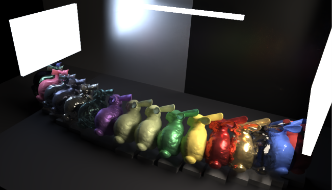
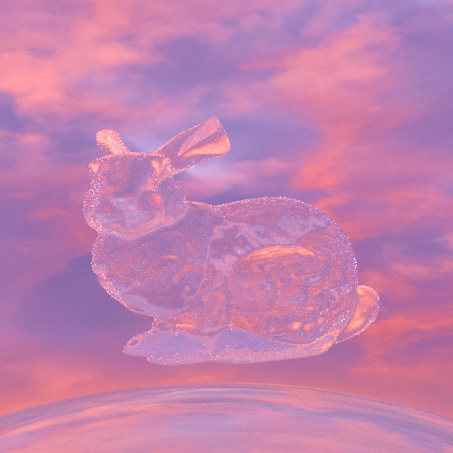
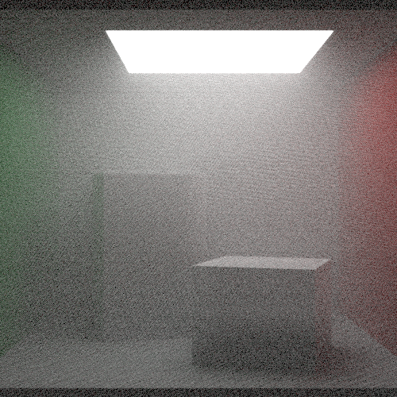

# Path Tracer

An NEE + MIS path tracer, supports various BxDFs / Lights / Volumes and Monte Carlo effects. Supports both CPU and GPU (Optix) backend.

## Project Links

- [Feature Roadmap / TODO](TODO.md)
- [ReSTIR DI Roadmap](docs/restir_di_roadmap.md)
- [GPU Backend Notes](gpu/README.md)



> Disney BSDF bunny array, with Optix denoiser. 




> Rough glass (alpha = 0.05) bunny with HDRI lighting


>  Disney Principled Bunny with Microfacet Conductor background


> Left: Rough gold material, Right: Marschner Hair material




> Cornell box with homogeneous fog, rendered with volumetric integrator.


## Backends

The project has two renderer backends:

* `cpu/` is the feature-rich CPU path tracer with the original material,
  light, sampler, and volume systems.
* `gpu/` is an experimental OWL/OptiX backend used to port the renderer to
  CUDA/RT cores incrementally.
* `common/` contains a small host/device math layer shared by both backends
  for formulas that are worth keeping numerically consistent, such as
  Fresnel and Trowbridge-Reitz/GGX microfacet helpers.

CPU/GPU scene loading and render settings now share a small validation-oriented
interface. Both backends can load the Mitsuba XML subset through the common
scene description layer, and both accept aligned render settings such as
`--width`, `--height`, `--spp`, `--max-depth`, `--gamma`, `--tonemap`,
`--background`, camera overrides, and `--debug-view`.

The GPU backend currently favors a clear architecture over premature kernel
specialization. OptiX closest-hit programs build a compact PRD, raygen owns the
path-tracing loop, and BSDF sampling is dispatched through GPU-friendly POD
materials instead of CPU virtual functions:

```text
radiance trace
  -> TriangleMesh closest-hit fills hitP / normal / materialId
  -> raygen fetches MaterialGPU from the global material buffer
  -> BSDF wrapper dispatches by MaterialGPU.kind
  -> optional direct-light sample shoots a shadow ray
```

The SBT currently stores geometry buffers plus `materialId`; per-frame data,
materials, and lights live in launch params / device buffers so they can be
updated without rebuilding the SBT. GPU materials are a flat tagged POD
(`MaterialGPU`) with BxDF dispatch for Lambertian, mirror, conductor,
microfacet dielectric, thin dielectric, and emissive surfaces. Per-material
closest-hit programs, TLAS instancing for repeated meshes, and wavefront
scheduling are intentionally deferred until profiling shows that they are the
next bottleneck.

The GPU backend also has a host-side OptiX denoiser pass. Raygen writes a
linear HDR accumulator; post-processing optionally denoises that buffer, then
tone maps to the OWLViewer framebuffer:

```text
OptiX raygen -> linear HDR accumBuffer -> optional OptiX denoiser
             -> CUDA tonemap/gamma/pack -> GL-shared framebuffer
```

For interactive use the denoiser is delayed until enough accumulated samples
are available and is only refreshed every few frames, so camera interaction
does not pay the denoiser cost on every launch.

## Build Instructions:

This project uses CMake. The root project defaults to CPU-only builds; the GPU
backend is enabled explicitly because it depends on CUDA, OptiX, OWL, GLFW, and
OpenGL. The root C++ standard is C++20, while the GPU subproject is forced to
C++17 for CUDA 11.x compatibility.

The recommended workflow is to use the checked-in presets, which keep CPU and
GPU build trees separate:

```powershell
# CPU renderer, RelWithDebInfo
cmake --preset cpu-relwithdebinfo
cmake --build --preset cpu-relwithdebinfo

# GPU renderer, RelWithDebInfo, Ninja
cmake --preset gpu-ninja-relwithdebinfo
cmake --build --preset gpu-ninja-relwithdebinfo
```

The generated executables are:

```text
build-cpu/cpu/src/RelWithDebInfo/PathTracer.exe
build-gpu-ninja/gpu/mypt.exe
```

There is also a Visual Studio generator preset for the GPU backend:

```powershell
cmake --preset gpu-relwithdebinfo
cmake --build --preset gpu-relwithdebinfo
```

For Cursor/CMake Tools, the workspace defaults to the Ninja GPU preset. This
avoids the Visual Studio generator's lowercase `all` target issue in the CMake
Tools build button. A separate `clangd-gpu` preset generates
`build-clangd/compile_commands.json` for clangd.

Unit tests are under `cpu/tests` and use GoogleTest. To run them from a CPU
build tree:

```powershell
ctest --test-dir build-cpu --output-on-failure -C RelWithDebInfo
```

When profiling the GPU backend, `mypt` accepts `--frames N` so external
profilers can run a deterministic number of frames and exit:

```powershell
.\build-gpu-ninja\gpu\mypt.exe --frames 120
```

## Validation and Debugging

The current CPU/GPU alignment entry point is the Cornell box XML scene:

```text
assets/validation/cornell_box.xml
```

Useful scripts:

```powershell
.\tools\run_xml_alignment_smoke.ps1
.\tools\run_backend_convergence_smoke.ps1
```

Both backends support deterministic debug output modes:

```powershell
--debug-view beauty
--debug-view normal
--debug-view albedo
--debug-view visibility
--debug-view material-id
--debug-view light-id
```

These modes are intended for CPU/GPU alignment and future ReSTIR DI debugging.
For the ReSTIR DI implementation plan, see
`docs/restir_di_roadmap.md`.


### Integrator:

* The path tracer uses an importance sampling strategy, a mixed PDF of Material PDF and light sampling with NEE (next-event-estimation).

* Other integrator includes

  * Volumetric path tracer (only null-tracking for now. NEE WIP)
  * An analytical calculation for Polygonal diffuse only lighting. (Ref. James Arvo)
  * Russian Roulette version MIS, w./w.o. NEE
  
  

### Monte Carlo and Post-processing effects:

The path tracer supports DoF, motion blur. Image filtering and tone-mapping.


### Materials:

CPU backend:

1. Marschner Hair
2. Phong
3. Dielectric (Microfacet BxDF + simple dispersion approximation)
   * Thin Dielectric
   * Split-ray variant for noise reduction.
4. Conductor (Microfacet BRDF, VNDF)
5. Lambertian
6. Kajiya-Kay
7. Disney Principled BSDF (a mix of 2015 / 2012 implementation details)

GPU backend:

1. Lambertian
2. Mirror
3. Conductor (smooth and rough microfacet)
4. Dielectric (smooth and rough microfacet)
5. Thin Dielectric
6. Emissive quads

The shared `common/` math layer currently covers Fresnel dielectric,
conductor Fresnel without `std::complex`, local-frame helpers, and
Trowbridge-Reitz/GGX distribution and sampling. The CPU backend keeps its
`gl::vec3` and virtual material hierarchy; shared code is used through thin
adapters rather than replacing the CPU data model wholesale.


### Object IO

1. .obj
2. .fbx (WIP)

The current GPU test scene loads `assets/bunny.obj` once and instantiates
several material variants of the bunny: lambertian, glass, thin glass, gold,
rough gold, and silver. This is still represented as separate mesh uploads;
moving repeated meshes to a shared BLAS plus TLAS instances is a planned next
step.


### Light

* Area light
* Sphere light
* HDRI (IBL)

The GPU backend currently supports quad area lights. CPU-only light types such
as sphere lights and HDRI are not yet ported.


### Sampler

1. Halton Sampler
2. Stratified Sampler
3. Sobol Sampler (WIP)
